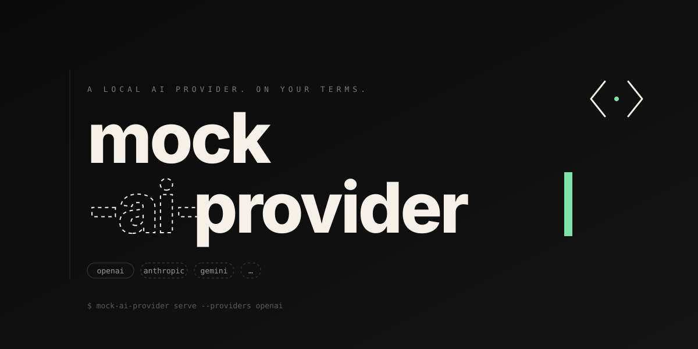

# mock-ai-provider

Provider-compatible mock servers for AI APIs. OpenAI is supported today; more providers are planned.

Point your existing SDK at a local URL and ship tests, demos, and offline development without touching a real provider. Your app stays vanilla: no mock-specific code, no SDK shims, just a different base URL.

<p align="center">
  
</p>

```sh
npx mock-ai-provider serve --providers openai
```

```js
new OpenAI({ baseURL: "http://127.0.0.1:31337/v1", apiKey: "local" });
```

That's the whole integration.

## Why

- **Zero app changes.** Your code keeps calling the real provider SDK. Only the base URL moves.
- **Deterministic.** Same request, same response. Great for CI and snapshot tests.
- **Scriptable.** Final text, tool calls, errors, delays, malformed bodies, timeouts — all from a small JSON file.
- **Full request journal.** Every call lands in `.mock-ai-provider/requests.jsonl`, secrets redacted, ready to `tail -f` or assert against.
- **Broad surface.** For OpenAI today: Chat, Responses, Completions, Embeddings, Images, Audio, Video, Files, Uploads, Batches, Vector Stores, Moderations, Fine-tuning, Models — including SSE streaming and tool calls.
- **No runtime dependencies.** One Node process. Fast to start, easy to embed in tests.

## Install

```sh
npm install -D mock-ai-provider
```

Or install globally when you want the command available everywhere:

```sh
npm install -g mock-ai-provider
```

## Run

```sh
npx mock-ai-provider serve --providers openai
```

With a global install:

```sh
mock-ai-provider serve --providers openai
```

| Default     | Value                                  |
| ----------- | -------------------------------------- |
| Base URL    | `http://127.0.0.1:31337/v1`            |
| Request log | `.mock-ai-provider/requests.jsonl`     |
| Auth        | Permissive (any bearer token accepted) |

Use `--port 0` to bind a random free port. Startup writes one JSON line to stdout so scripts can discover the actual URL:

```json
{"ok":true,"baseUrl":"http://127.0.0.1:31337","port":31337,"requestLog":".mock-ai-provider/requests.jsonl"}
```

## CLI

```sh
mock-ai-provider serve \
  --providers openai \
  --script ./mock-script.json \
  --port 31337 \
  --request-log .mock-ai-provider/requests.jsonl \
  --strict-auth --api-key sk-test
```

- `--providers openai` — enabled providers.
- `--script <path>` — scripted responses (see below).
- `--models <path>` — custom model catalog.
- `--port <number|0>` — `0` picks a free port.
- `--request-log <path>` — JSONL journal output.
- `--strict-auth` + `--api-key <key>` — require a specific bearer token.

## Scripted Responses

Drive any request shape from a small JSON file. Steps run in order, or match by API surface, model, body path, or tool-call state.

```json
{
  "id": "agent-flow",
  "steps": [
    {
      "match": { "apiSurface": "chat.completions" },
      "respond": {
        "type": "tool-calls",
        "toolCalls": [{ "name": "lookup_order", "arguments": "{\"id\":\"123\"}" }]
      }
    },
    {
      "match": { "apiSurface": "chat.completions", "hasToolResult": true },
      "respond": { "type": "final-text", "text": "Your order is ready." }
    }
  ]
}
```

Response types: `final-text`, `tool-calls`, `error`, `malformed`, `timeout`, `delay`. Reload at runtime by `POST`ing to `/admin/script`.

## Request Journal

Every request is appended as one JSONL line: parsed body, headers, status, matched script step, emitted tool calls, and final text. API keys, bearer tokens, OAuth tokens, passwords, and private keys are redacted automatically. Binary uploads are summarized, not stored.

```sh
tail -f .mock-ai-provider/requests.jsonl
```

Inspect or reset programmatically:

```text
GET  /admin/requests      # latest entries (?limit=N)
POST /admin/reset         # clear journal
POST /admin/script        # hot-swap script
GET  /health  /status
```

## Examples

- [examples/openai-node.md](examples/openai-node.md)
- [examples/openai-python.md](examples/openai-python.md)
- [examples/curl.md](examples/curl.md)
- [examples/openclaw-provider-config.md](examples/openclaw-provider-config.md)

## Development

```sh
pnpm install
pnpm run check    # build + tests
pnpm run serve    # build + start
```

Requires Node ≥ 22.19. No runtime dependencies.

## License

MIT
